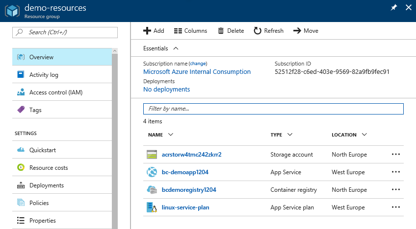
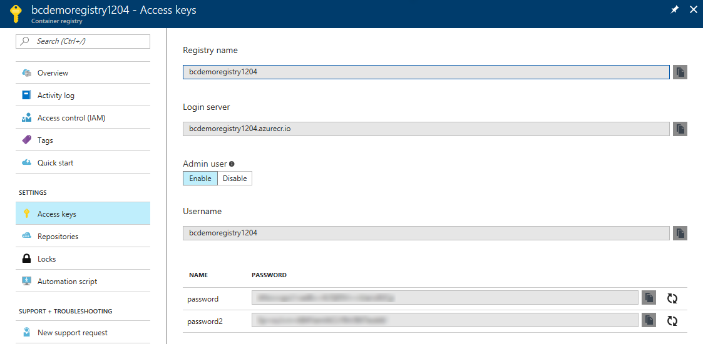
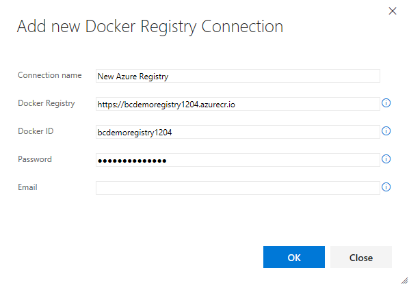
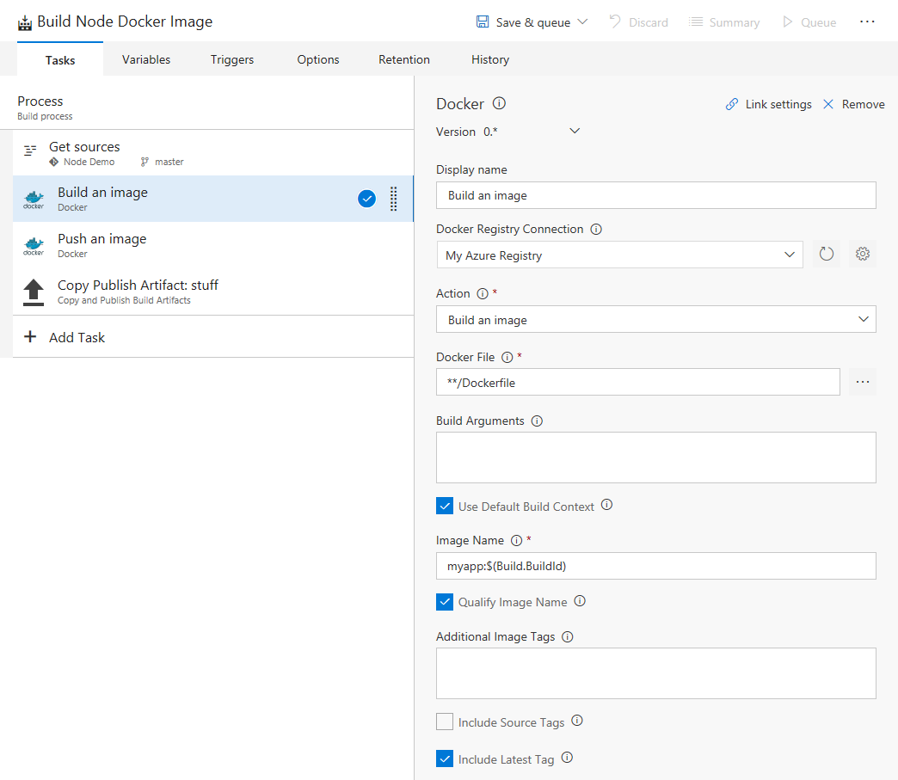
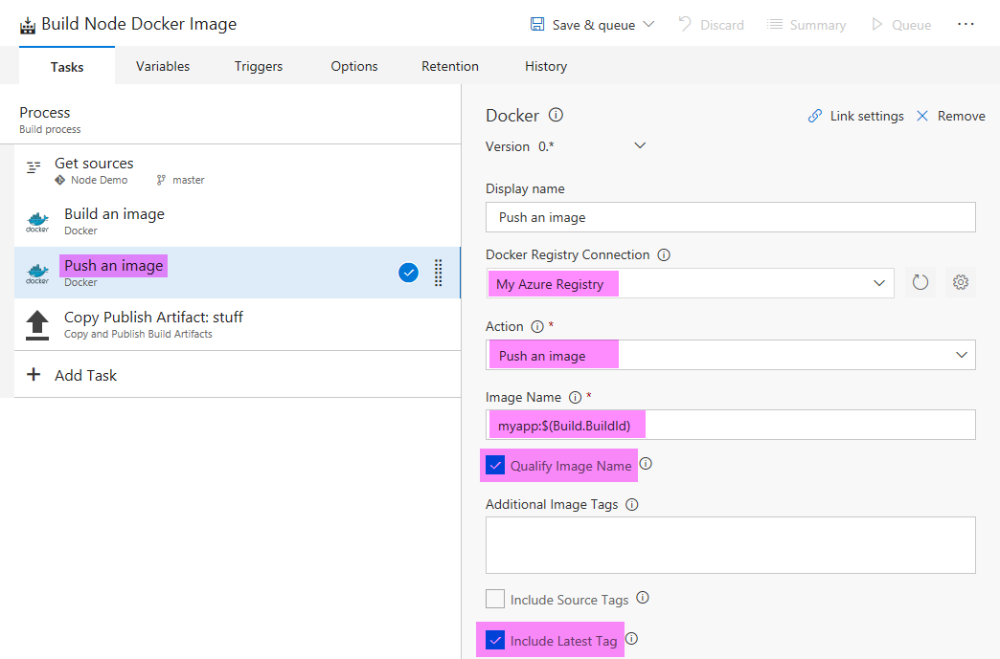
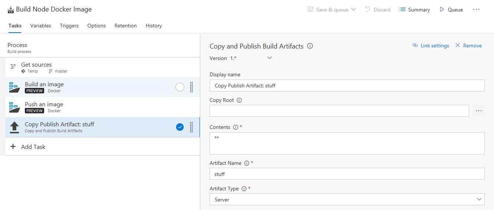

# Azure DevOps Lab with Node.js, Azure, Docker & VSTS

## Synopsis
#### From first principals and nothing but VS Code, an empty directory and a command terminal we will create a working web Node.js app running in Azure web platform services & Docker, deployed via an automated DevOps CI/CD pipeline

The scenario will cover:
* Node.js
* Docker
* Azure Container Registry 
* Azure Web App (Linux)
* VSTS

You do not need to be an Node.js or JavaScript expert for the coding part but you will need to make basic changes to a JS file. Likewise no prior experience with VSTS and Azure is required (but obviously beneficial). We will also spend some time with Docker registries and image building & tagging. You will be able to complete the lab with either a Windows or Mac machine, but only Windows has been tested.

The high level overall flow is:
* Generate Node.js Express app
* Add Docker support
* Git repo setup
* Deploy resources in Azure from template
* Get Azure Container Registry details 
* Creation of VSTS project and code repo
* Push of git repo into VSTS
* Create & run VSTS build definition 
* Create & run VSTS release definition 
* Resulting in our Node app deployed & running in a Azure Linux Web App

---

## Pre-requisites 
:warning: **Do not ignore this part!** :warning:  
You will need the following things set up and installed on your machine: 
* An active [Azure subscription](https://portal.azure.com/). If you do not have a subscription:
  * You may have been given an [Azure Pass](https://www.microsoftazurepass.com/) card & code, please follow the steps given to activate your new subscription.
  * OR - create a [free Azure account and subscription](https://azure.microsoft.com/en-gb/free/)
* An active [VSTS Account](https://app.vsaex.visualstudio.com/)
  * If you don't have an account, [create a free VSTS account](https://www.visualstudio.com/en-gb/docs/setup-admin/team-services/sign-up-for-visual-studio-team-services)
* Install [Node.js](https://nodejs.org/en/download/)
* Install [VS Code](https://code.visualstudio.com/download)
  * Required extension: Docker (Ctrl+P `ext install vscode-docker`)
* Install git; [Git for Windows](https://git-scm.com/download/win) or [Git for Mac](https://git-scm.com/download/mac)
* Optional but strongly recommended: [Git credential manager](https://www.visualstudio.com/en-us/docs/git/set-up-credential-managers)

## Initial Setup Steps
Overview of steps:
 * Create a new VSTS account (or new project if you already have an account)
 * Enable Docker support in VSTS via the marketplace. Open this link in a new tab: [Visual Studio Marketplace](https://marketplace.visualstudio.com/items?itemName=ms-vscs-rm.docker) and click "Install"
 * If you've never run git before, run these commands (modifying with your details as required):
 ```
git config --global user.email "your-email@example.com"
git config --global user.name "Your Name"
git config --global credential.helper manager
```

---

# Main Exercise Flow
With all the setup pre-reqs complete, what follows is the full step by step guide to the exercise 

## 1. Create Node.js / Express web app
We'll use the well know [Express](https://expressjs.com/) web framework for Node.js, and it's builtin generator to create a skeleton application.   
Open a command prompt or terminal and run the following commands:
```bash
npm install express-generator -g
express --view=pug myapp
cd myapp
npm install
```
This will use NPM (Node Package Manager) to install the Express generator, then create a new app and folder called 'myapp', then install the Node modules required.
> Note. You can call the app folder anything you like, you don't need to call it 'myapp'

Now open your project folder in VS Code
```bash
code .
```
Take a look around, there's not a huge amount to see, but we'll probably dive into the `views` folder in a second to customise the app a little.

From VS Code, press `Ctrl+'` to open the builtin terminal and run:
```bash
npm start
```
This will start the Node/Express app + webserver which will be listening on port 3000, so open [`http://localhost:3000`](http://localhost:3000) in your browser to see your app.  

Looks pretty dull eh? It's not the most exciting starting page for sure. If you go back to VS Code and open ***views/index.pug*** you can change what your app shows. This file is a view layout in a format called 'Pug', which has a special format like a very minimal HTML, you can find out the basics [here](https://www.sitepoint.com/jade-tutorial-for-beginners/). This is an example:
```pug
extends layout

block content
  h1 Linux PaaS - Demo Web App
  h3 Microsoft &hearts; Open source
  h3 Let's run this in Azure with Docker
  button OK Great!
```
Any changes to Pug views are picked up without needing to restart Node, so just refresh the browser.  
How much you want to personalize and tweak it from here is up to you. If you know CSS then some quick edits to ***public/stylesheets/style.css*** can make things less of an eyesore.  

Once you you're happy move on to the next step, press `Ctrl+C` in your VS Code terminal to stop Node from running.


## 2. Containerize the app 
Now we'll add Docker support to the app to containerize it. The Docker extension for VS Code makes this super easy.  
* Press `Ctrl+Shift+P` then type "docker"
* Select 'Add docker files to workspace'
* Choose 'Node.js' for application platform
* Choose '3000' for the port (no quotes)

This will add three files to your project, the two compose YAML files we can ignore. The **Dockerfile** is what we're interested in. We don't need to make any changes but if you're unfamiliar with Docker, it's worth opening and looking at, if you've created Docker images before, then move on. Some explanation of the **DockerFile**:  
- Since, a Docker image is nothing but a series of layers built on top of each other, you nearly always start from a base image. The `FROM` command sets the base image, here we're using an image pre-built with Node.js. This is an official image published by the Node foundation and [hosted on Dockerhub](https://hub.docker.com/_/node/).  
- The series of `COPY` and `RUN` commands go about running the `npm install` just as we did earlier and also copying in your app source into the image.  
- The `EXPOSE` command is a hint which ports your application and will be listening on and need to be mapped out to the container when it runs.  
- The last `CMD` part is what starts the app up, just as we did with `npm start`.  


## 3. Create git repo and push to VSTS
To start to get a CI/CD pipeline going we need our code in source control so let's create a git repo and add our code to it. You can do this from the source control view in VS Code; the branch icon on the lefthand toolbar (also `Ctrl+Shift+G`) or from the integrated terminal you can run:
```
git init
git add .
git commit -m "First commit"
```
To get the code up into VSTS, go into your new project and we'll need to set the remote origin for the repo and push it.  
> Note. You will get the correct URL & syntax for this part by expanding the *"push an existing repository from command line"* section of the project start page or from the 'code' section in VSTS
```
git remote add origin https://{vsts_account}.visualstudio.com/_git/{project}
git push -u origin --all
```
If you have the git credential manager installed, authentication should should automatically pop up, so login with your VSTS account details.  
If you have trouble and you get username/password prompt at the command line, you have the option of manually creating git credentials by going into *VSTS --> Code --> Generate Git credentials*

You can validate this has worked by looking to the 'Code' section on the main VSTS menu.


## 4. Deploy resources to Azure
Switching from VSTS to Azure for a moment, we'll set about creating the cloud resources we need to support our application and release pipeline. We'll do this by deploying a template, also called an ARM (Azure Resource Manager) template. This template is a json file that describes all the resources to be built, and any input parameters we want to supply. This template has been created for you and will deploy into Azure:
* Azure Container Registry
* Linux App Service Plan
* Linux Web App
* Storage Account

There are many ways to deploy this template, but we'll use a simple "Deploy to Azure" button and URL. Go into the [Azure folder under this repository](azure/) and you should see a page with big blue button which will jump into the Azure portal ready to deploy our template. You will be prompted for a number of things: 
* *Resource group* - This group will hold all your resources. Choose any name you like
* *Location* - Pick a local Azure region e.g. North or West Europe or one of the UK regions
* *Site Name* - This is the name of your new site and Linux web app, :warning: Important! Pick a globally unique name as this site will be registered in global DNS. Suggestion, to use your initials and/or date, e.g. *`node-demo-bc-1204`*
* *Registry Name* - This is the name of your new Docker registry, same as above *must be a globally unique name!* and only use letters and numbers
* *Docker Image Name* - Leave this as `myapp` for now
* *Docker Image Port* - Leave this as `3000` for now

Tick the 'I agree to the terms and conditions stated above' checkbox. If you've never used the Azure portal before, I also advise ticking the 'Pin to dashboard' option too. Then click 'Purchase' to start deployment.  
Deployment should take about 1-2 minutes...  

<!--[if lt IE 9]><script src="http://html5shiv.googlecode.com/svn/trunk/html5.js"></script><![endif]-->

Once deployed, go into the new resource group and then click into the Container Registry as we'll need to get some information. The blade in the portal will open and from there click 'Access keys'. Three bits of info we need:  
* Login server
* Username (Note: this is always the same as the name of the registry)
* Password (pick any one of the two)
Copy and paste these into a scratch pad file, as we'll need them in a moment.
<details>
  <summary>View screenshots of this step (Click to expand/collapse)</summary>

  
  
</details>

## 5. VSTS Build Process
First we'll add a connection to the Docker registry we created, using the information we previously gathered:  
* Click the cog on the menu bar and go into 'Services'
* Click 'New Service Endpoint' and pick 'Docker Registry' - 
  * *Connection name:* Pick any sensible name
  * *Docker Registry:* URL pointing at your new registry, e.g. `https://{registry-login-server}` note the server ends in `.azurecr.io`
  * *Docker ID:* The username for your registry (Note: this is always the same as the name of the registry)
  * *Password:* The password you made a note of
<details>
  <summary>View screenshot of this step (Click to expand/collapse)</summary>

  
</details>  
  

Click OK and move over to the 'Build & Release' section VSTS. If you are prompted to use the 'New Build Editor' click yes, as it's much nicer and you will be able to follow my steps easier.  
* Choose "empty process" rather than a template
* Give a sensible name to the definition
* Click 'Add Task', search for "docker" and add the top task (simply called "Docker") TWICE
* While still in the 'Add Task' view, search for "copy" and add the task called "Copy and Publish Build Artifacts"
* Click the first Docker task in the list, change the following:
  * Select your new Docker registry connection from the drop down
  * Tick three options: 'Use Default Build Context', 'Qualify Image Name' & 'Include Latest Tag'
  * Change the 'Image Name' to `myapp:$(Build.BuildId)`
* Click the second Docker task in the list, change the following:
  * Change the 'Action' to "Push an image"
  * Select your new Docker registry connection from the drop down
  * Tick two options: 'Qualify Image Name' & 'Include Latest Tag'
  * Change the 'Image Name' to `myapp:$(Build.BuildId)`
* Click the 'Copy Publish' action
  * Change the 'Contents' to two asterisks `**`
  * Change 'Artifact Name' to anything you like e.g. `stuff`
  * For the 'Artifact Type' pick "Server"
* Two final steps:
  * Click on 'Triggers' at the top of the defintion and enable 'Continuous Integration'
  * Next to that click on 'Options' and change the 'Default agent queue' to "Hosted Linux Preview"
<details>
  <summary>View screenshots of this step (Click to expand/collapse)</summary>

  Screenshots of the four major steps are: 
  
  
  
    
  
</details>

Phew! That's a lot of manual steps, sorry!


---

# Summary
You should now have a containerized blah xxxx

---

# Appendix

## Suggested cleanup & removal tasks
 * Yes
 * Words here

